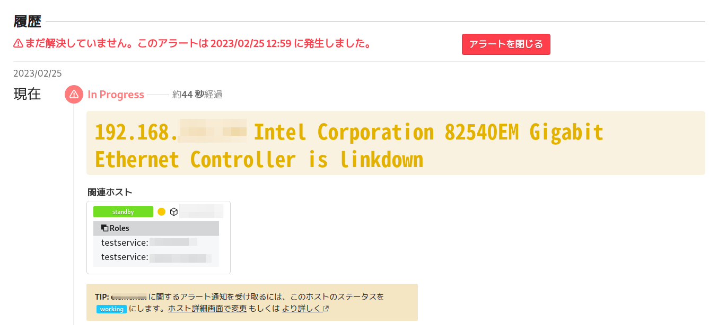

# sabatrapd


## 概要

**sabatrapd**は、ネットワーク機器からSNMP Trapを受け取り、監視サービス[Mackerel](https://ja.mackerel.io/)のチェック監視項目として投稿するミドルウェアです。

SNMP Trapとは、ネットワーク機器側からサーバーに状態の変化を報告するpush型の仕組みです。緊急性の高い異常な状態（リンクダウンやオーバーヒートなど）を素早く報告するために使われます。

（MackerelのSNMP対応としては[mackerel-plugin-snmp](https://mackerel.io/ja/docs/entry/plugins/mackerel-plugin-snmp)がありますが、これはネットワーク機器から定期的に情報を取得するpull型のものです。）

## 制約

- 本プログラムは無保証です。
- プロトコルはSNMP v2cのみに対応しています。
- SNMP Trapの内容は「WARNING」としてMackerelに投稿され、アラートになります。SNMP Trapの原因が解消されてもsabatrapdでは関知できないので、Mackerel上でアラートを手動で閉じる必要があります。そのため、SNMP Trap捕捉は最小限に留めることを推奨します。

## セットアップ

[Goの開発環境](https://go.dev/dl/)をインストールした後、以下のコマンドでsabatrapdをインストールします。

```
go install github.com/yseto/sabatrapd@latest
```

Mackerel側では、以下の作業をしておいてください。

1. 投稿先のMackerelのオーガニゼーションに、チェック監視の投稿先となるスタンダードホストを用意します。
2. MackerelのオーガニゼーションからAPI（書き込み権限）を払い出します。

## 設定

sabatrapdの設定はYAMLファイルで行います。

`sabatrapd.yml.sample`ファイルを`sabatrapd.yaml`という名前にコピーしてください。

`sabatrapd.yml`ファイルに、MackerelオーガニゼーションのAPI文字列とホストIDを記述します。

```
mackerel:
  x-api-key: API文字列
  host-id: ホストID
```

次に、snmptrapdがサービスとして監視するIPアドレス、ポート番号、それにSNMPコミュニティ名を指定します。

```
snmp:
  addr: 0.0.0.0
  port: 9162
  community: public
```

- 上記の設定では、IPv4アドレスで到達可能な範囲からのアクセスを受け付け（`0.0.0.0`）、ポート番号は9162（UDP）を使用、SNMPコミュニティは「public」としています。
- SNMP Trapを送る機器上で送信先ポートを指定できないときには、sabatrapd側の監視ポート番号を標準ポートである「162」にします。この場合、sabatrapdをroot権限で実行する必要があります。
- SNMPコミュニティの名前はSNMP Trapを送る機器に合わせます。コミュニティの異なるSNMP Trapは無視されます。
- SNMPコミュニティ設定は1つのみ指定できます。複数のSNMPコミュニティで運用しなければならないときには、`community`行を削除して、コミュニティの名前照合をスキップするようにしてください。

## 実行

`sabatrapd.yml`の置いてあるフォルダーで、sabatrapdを起動します。

```
$GOPATH/bin/sabatrapd
```

SNMP Trapをsnmptrapdに送ると、捕捉対象のものだったときにはMackerelにすぐにアラートが通知されます。



`debug`設定を`true`にすると、受け取ったSNMP Trapメッセージや詳細なログが出力されます。SNMP Trapメッセージをうまく処理できないときにご利用ください。

### 詳細設定

より高度な設定・カスタマイズについて説明します。

#### MIBの用意

MIB（Management Information Base）ファイルをsabatrapdに登録すると、SNMP Trapメッセージの項目を抽出して投稿内容に含めることができます。

デフォルトの設定は以下のとおりです。

```
mib:
  directory:
    - "/var/lib/snmp/mibs/ietf/"
  modules:
    - SNMPv2-MIB
    - IF-MIB
```

`directory`にMIBファイルを格納するフォルダーを指定し、`modules`に読み込むMIBファイル名を列挙します。子フォルダーは探索しないので、MIBファイルは`directory` のフォルダーの直下に置いてください。

MIBファイルはベンダー各社から提供されています。たとえばDebian/Ubuntuの場合は、snmp-mibs-downloaderパッケージ（non-freeセクション）をインストールすると、`/var/lib/mibs/ietf` フォルダーに`SNMPv2-MIB`や`IF-MIB`などのMIBファイルが置かれます。

### SNMP Trap捕捉メッセージの設定

SNMP Trapは内容に応じて「`.1.3.6.1.6.3.1.1.5.1`」のような固有のOID（Object Identifier）を持ちます。ベンダーごとに独自のものが用意されており、共通のものは最低限です。

デフォルトで記載済みの設定は以下のとおりです。

```
trap:
  - ident: .1.3.6.1.6.3.1.1.5.1
    format: '{{ addr }} is cold started'
  - ident: .1.3.6.1.6.3.1.1.5.2
    format: '{{ addr }} is warm started'
  - ident: .1.3.6.1.6.3.1.1.5.3
    format: '{{ addr }} {{ read "IF-MIB::ifDescr" }} is linkdown'
  - ident: .1.3.6.1.6.3.1.1.5.4
    format: '{{ addr }} {{ read "IF-MIB::ifDescr" }} is linkup'
```

`ident`に捕捉したいSNMP TrapのOID、`format`にMackerelへ投稿するメッセージというペアで記述します。`format`内では以下の2つのプレースホルダーを指定できます。

- `{{ addr }}`: SNMP Trap元のIPアドレスに展開されます。
- `{{ read "MIBモジュール名::MIBオブジェクト名" }}`: 読み込み済みのMIBファイル内に記載されているモジュール名およびオブジェクト名に基づき、SNMP Trap内の対応する情報を展開します。

上記の設定の場合、MIBモジュール名`IF-MIB`（`IF-MIB`ファイル）のオブジェクト名`ifDescr`（インターフェイスの説明）に相当する値をSNMP Trapから探します。これはたとえば「Intel Corporation 82540EM Gigabit Ethernet Controller」のようになります。インターフェイス番号を示したければ、`IF-MIB::ifIndex`を使います。

どのようなMIBオブジェクトが利用可能かは、各MIBファイルを参照してください。

SNMP Trapを捕捉しすぎると、無用なアラートがMackerelで多発することになります。緊急性の高い最低限のもののみ設定するようにすることをお勧めします。

### ネットワーク機器ごとの文字エンコーディング設定

一部のネットワーク機器では、Shift JISエンコーディングの日本語メッセージを発行することがあります。Mackerelに投稿する際にはUTF-8エンコーディングでなければならないため、ネットワーク機器のIPアドレスを明示して変換対象とするようにします。

たとえばIPアドレス「192.168.1.200」のネットワーク機器からのShift JISエンコーディングのメッセージを変換対象とするには、以下のように記載します。

```
encoding:
  - addr: 192.168.1.200
   charset: shift-jis
```

### プロキシの設定

インターネットに接続するのにプロキシサーバーを利用している場合は、環境変数`HTTPS_PROXY`にプロキシサーバーを設定してからsabatrapdを実行してください。

```
export HTTPS_PROXY=https://proxyserver:8443
```

## オプション

sabatrapdはいくつかのオプションをとることができます。

- `-conf <設定ファイル>`: 設定YAMLファイルを指定します。このオプションを省略したときには、デフォルトでカレントフォルダーにある`sabatrapd.yml`を参照します。
- `-dry-run`: MackerelのAPIにメッセージを投稿しないモードで動作します。本番の監視の前に、SNMP Trapの挙動を確認したいときに指定します。

## 起動の自動化

(★★TBD)

## ライセンス

Copyright 2023 yseto and Kenshi Muto

Licensed under the Apache License, Version 2.0 (the "License"); you may not use this file except in compliance with the License. You may obtain a copy of the License at

```
http://www.apache.org/licenses/LICENSE-2.0
```

Unless required by applicable law or agreed to in writing, software distributed under the License is distributed on an "AS IS" BASIS, WITHOUT WARRANTIES OR CONDITIONS OF ANY KIND, either express or implied. See the License for the specific language governing permissions and limitations under the License.

## 使用ライブラリ

- https://github.com/sleepinggenius2/gosmi/
- https://github.com/gosnmp/gosnmp
